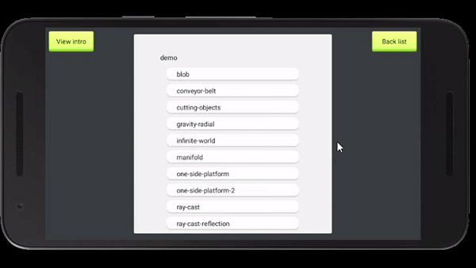
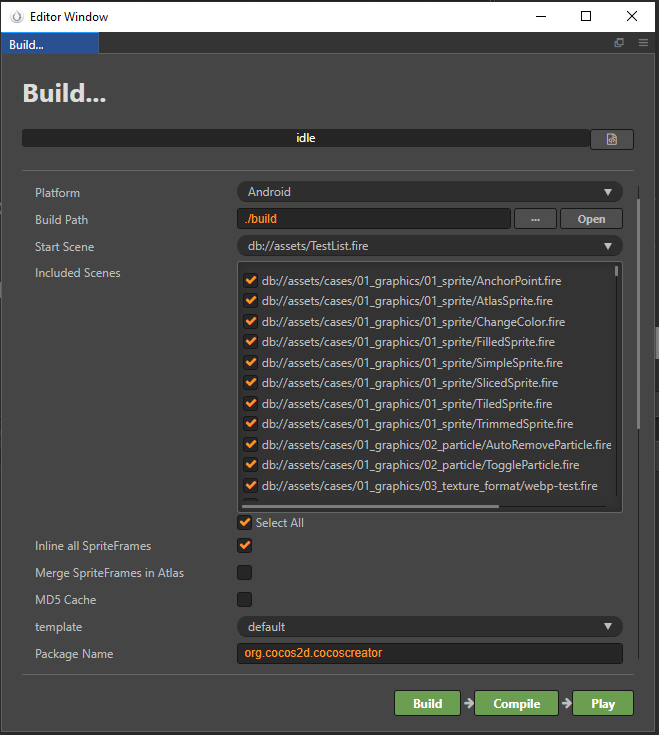
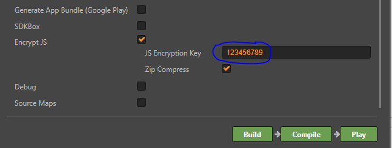

<p align="center">

</p>

# Xamarin.CocosCreator #

## Packages ##

### Lastest ###

[](https://www.nuget.org/packages/CocosCreator/)

Platform/Feature               | Package name                              | Stable      | Cocos Creator Version
-----------------------|-------------------------------------------|-----------------------------|-------------------------|
CocosCreator             | `CocosCreator` |  -  | 2.2.0 - 2.2.2 |
CocosCreator             | `CocosCreator` |  -  | 2.3.0 |
CocosCreator             | `CocosCreator` |  -  | 2.3.3 |
CocosCreator             | `CocosCreator` |  | 2.4.3 |
CocosCreator             | `CocosCreator` |  | 2.4.5 |




## Samples ##

https://github.com/toanlcgift/xamarin-cocoscreator-samples

## Getting Started ##

### Environment ###

- CocosCreator v2.x
- Visual Studio 2017+
- nuget version >= 2.2.7 supports Xamarin.Forms

### Build your Cocos Creator Project ###

- template: default
- platform: android/iOS
- buildPath: ./build

<p align="center">

</p>

### Xamarin Android (nuget <= 2.2.6) ###
##### Install nuget CocosCreator #####

##### 1. Create Android Activity #####

```C#
  public class MainActivity : Cocos2dxActivity
  ```
  
##### 2. Override OnCreate #####

```C#
protected override void OnCreate(Bundle savedInstanceState)
        {
            if (!IsTaskRoot)
            {
                return;
            }

            Java.Lang.JavaSystem.LoadLibrary("cocos2djs");
            this.Setxxteakey("123456789");
            base.OnCreate(savedInstanceState);
            app = this;
            Xamarin.Essentials.Platform.Init(this, savedInstanceState);
            
        }
  ```
  *NOTE: Make sure the xxteakey is matched with your cocos creator's build setting*
  
  <p align="center">

</p>

##### 3. override Cocos2dxGLSurfaceView OnCreateView() #####

```C#
  public override Cocos2dxGLSurfaceView OnCreateView()
        {
            Cocos2dxGLSurfaceView glSurfaceView = new Cocos2dxGLSurfaceView(this);
            glSurfaceView.SetEGLConfigChooser(8, 8, 8, 8, 16, 0);
            return glSurfaceView;
        }
  ```
  
  ##### 4. Copy Resources #####
  
  Copy resources in Cocos Creator's build folder to Xamarin.Android Assets folder (except frameworks & js backups folder)
  
  - jsb-adapter
  - res
  - src
  - subpackages
  - main.js
  - project.json
  - ...
  
  ##### 5. Add to your android project *.csproj file #####
  
  ```xml
  <ItemGroup>
    <AndroidAsset Include="Assets\**" />
  </ItemGroup>
  ```
  
### Xamarin iOS (nuget <= 2.2.6) ###
##### Install nuget CocosCreator #####

##### 1. Create iOS AppDelegate #####

```C#
  public partial class AppDelegate : AppController
  ```
  
##### 2. Override DidFinishLaunchingWithOptions #####

```C#
public override bool DidFinishLaunchingWithOptions(UIApplication app, NSDictionary options)
        {
            options = new NSDictionary(new NSString("xxtea_key"), new NSString("123456789"));
            return base.DidFinishLaunchingWithOptions(app, options);
            
        }
  ```
  *NOTE: Make sure the xxteakey is matched with your cocos creator's build setting*
  
  <p align="center">

</p>

  ##### 3. Copy Resources #####
  
  Copy resources in Cocos Creator's build folder to Xamarin.iOS Resources folder (except frameworks & js backups folder)
  
  - jsb-adapter
  - res
  - src
  - subpackages
  - main.js
  - project.json
  - ...
  
  ##### 4. Add to your iOS project *.csproj file #####
  
  ```xml
    <BundleResource Include="Resources\**">
      <Optimize>False</Optimize>
    </BundleResource>
  ```
  
  ##### Please run sample project to check all configuration #####
  
  *NOTE: This package does not support iOS emulator*
  
  ### Xamarin.Forms (nuget >= 2.2.7) ###
  
  #### Android ####
  
  ##### 1. init CocosViewRenderer in MainActivity.cs ##### 
  ```C#
  CocosViewRenderer.Init(this, savedInstanceState, [js_encrypted_key]);
  ```
  ##### 2. Copy Resources
  
  Copy resources in Cocos Creator's build folder to Xamarin.iOS Resources folder (except frameworks & js backups folder)
  
  - jsb-adapter
  - res
  - src
  - subpackages
  - main.js
  - project.json
  - ...
  
  ##### 3. Add to your android project *.csproj file #####
  
  ```xml
  <ItemGroup>
    <AndroidAsset Include="Assets\**" />
  </ItemGroup>
  ```
  
  #### iOS ####
  
   ##### 1. init CocosViewRenderer in AppDelegate.cs ##### 
   
   ```C#
   CocosViewRenderer.Init([js_encrypted_key]);
   ```
   
   ##### 2. Copy Resources
  
  Copy resources in Cocos Creator's build folder to Xamarin.iOS Resources folder (except frameworks & js backups folder)
  
  - jsb-adapter
  - res
  - src
  - subpackages
  - main.js
  - project.json
  - ...
  
   ##### 3. Add to your iOS project *.csproj file #####
  
  ```xml
    <BundleResource Include="Resources\**">
      <Optimize>False</Optimize>
    </BundleResource>
  ```
  
  #### Net Standard ####
  In your xaml page:
  
  ```xml
  xmlns:cocosforms="clr-namespace:CocosCreator.Forms;assembly=CocosCreator.Forms"

  <cocosforms:CocosView NativeCallCommand="{Binding NativeCallCommand}" />
  ```
  
  ### Advanced topics ###
  
  ##### 1. How to Call Xamarin.Android & Xamarin.iOS C# methods using JavaScript #####
  
  please refer articles for [android](https://docs.cocos.com/creator/manual/en/advanced-topics/java-reflection.html) & [ios](https://docs.cocos.com/creator/manual/en/advanced-topics/oc-reflection.html) first
  
  In cocos creator javascript:
  
  ```js
  if (cc.sys.os === cc.sys.OS_ANDROID) {

            var result = jsb.reflection.callStaticMethod("org/cocos2dx/lib/Cocos2dxActivity", // Cocos2dxForms instead if using nuget 2.2.7+
             "paramFromJSStaticString", "(Ljava/lang/String;Ljava/lang/String;)Ljava/lang/String;",
              "cocos2d-js",
               "Native Call Test");
            cc.log(result);
        }
        else if (cc.sys.os === cc.sys.OS_IOS) {
            var ret = jsb.reflection.callStaticMethod("NativeOcClass",
                "callNativeWithReturnString:andContent:",
                "cocos2d-js",
                "Native Call Test");
            cc.log(ret);
        }
  ```
  
  To get the value from js:
  
  - In android, override following methods in MainActivity:
   
   ```C#
    public override void ParamFromJSVoid(string title, string message)
        {
            System.Diagnostics.Debug.WriteLine($"title: {title}, message: {message}");
        }

        public override int ParamFromJSInt(string title, string message)
        {
            return base.ParamFromJSInt(title, message);
        }

        public override string ParamFromJSString(string title, string message)
        {
            return base.ParamFromJSString(title, message);
        }
   ```
   
   - In ios, override following methods in AppDelegate:
   
   ```C#
    public override bool CallNativeWithReturnBool(string title, string content)
        {
            System.Diagnostics.Debug.WriteLine($"CallNativeWithReturnBool: title: { title} & content: {content}");
            return base.CallNativeWithReturnBool(title, content);
        }

        public override string CallNativeWithReturnString(string title, string content)
        {
            System.Diagnostics.Debug.WriteLine($"CallNativeWithReturnString: title: { title} & content: {content}");
            return base.CallNativeWithReturnString(title, content);
        }
   ```
   
   - Xamarin.Forms:
   
   Please implement MVVM and binding to NativeCallCommand in ViewModel
   ```C#
   
   public ICommand NativeCallCommand { get; set; } = new Command(OnExecuteNativeCallCommand);
   
   private void OnExecuteNativeCallCommand(object obj)
        {
            CocosCreator.Forms.JSBrigde.EvaluateScript("cc.TestNativeCallJS()");
        }
   
   ```
  ##### 2. C# Call Javascript #####
  - Xamarin.Android:
  
  ```C#
    app.RunOnGLThread(new Runnable(() =>
            {
                Cocos2dxJavascriptJavaBridge.EvalString("cc.TestNativeCallJS()");
            }));
   ```
   
   - Xamarin.iOS:
   
   ```C#
    AppController.EvalScript("cc.TestNativeCallJS()");
   ```
   
   - Xamarin.Forms:
   
   ```C#
   CocosCreator.Forms.JSBrigde.EvaluateScript("cc.TestNativeCallJS()");
   ```
   
  ##### 3. Cocos Creator HotUpdate #####
  
  Of course, it's fully compatible with Xamarin!
  
  ##### 4. SDK box integration? #####
  
  No, don't need anymore, we have Xamarin Community instead!
